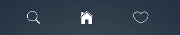

# 
 Features 

###  Text Box 

####

	
	<TextInput
    	style={style}
    	placeholder={text}
    	placeholderTextColor={'rgba(255,255,255,0.7)'}
	/>
	<Icon name="person" size={27} color="rgba(255,255,255,0.8)"/>

####
####

	<TextInput
        style={style}
        placeholder={text}
        secureTextEntry={boolean_value}
        placeholderTextColor={'rgba(255,255,255,0.7)'}
    />
    <Icon name="ios-unlocked-outline" size={27} color="rgba(255,255,255,0.8)"/>

####

####
###  Buttons 

####
#### Round Button

	<ButtonRounded
		onPress={function_call()}
		text="Round Button"
	/>

####
####
#### Circular Button

	<CircularButton
		onPress={function_call()}
		text={<Icon name="sign-out" size={35} color="rgba(255,255,255,0.9)"/>}
	/>

####
####
#### Colored Round Button

	<ButtonColorRounded
		onPress={function_call()}
		text="Colored Round Button" 
	/>

####

####
###  Links 

####

	<TouchableOpacity onPress={function_call()}>
        <Text style={style}>
            Forgot Password
        </Text>
    </TouchableOpacity>

####

####
###  Switch 

####
#### iOS
	<SwitchIOS
    	onValueChange={(value) => this.setState({colorFalseSwitchIsOn: value})}
    	onTintColor={"color"}
    	thumbTintColor="color"
    	tintColor="color"
    	style={{style}}
    	value={this.state.colorFalseSwitchIsOn}
    />

####
####
#### Android
		<SwitchAndroid
	        onValueChange={(value) => this.setState({trueSwitchIsOn: value})}						            
	        value={this.state.trueSwitchIsOn}
	    />

####

####
###  Forms 

####

	<View style={{style}}> 
		<Text style={style}> Input Types </Text>
		<TextInput
		    style={style}
		    placeholder={'Name'}
		    placeholderTextColor={'rgba(0,0,0,0.6)'}
		/>
		<Icon name="person" size={27} color="rgba(0,0,0,0.6)" style={{style}}/>
	 
	    <TextInput
		    style={style}
		    secureTextEntry={'boolean_value'}
		    placeholder={'Password'}
		    placeholderTextColor={'rgba(0,0,0,0.6)'}
		/>
		<Icon name="ios-unlocked-outline" size={27} color="rgba(0,0,0,0.6)" style={{style}}/>

		<TextInput
		    style={style}
		    placeholder={'About'}
		    multiline={'boolean_value'}
		    placeholderTextColor={'rgba(0,0,0,0.6)'}
		/>
		<Icon name="ios-help-outline" size={27} color="rgba(0,0,0,0.6)" style={{style}}/>

		<Text style={style}> Yes </Text>
		<SwitchIOS
			onValueChange={(value) => this.setState({colorTrueSwitchIsOn: value})}
			onTintColor={"color"}
			thumbTintColor="color"
			tintColor="color"
			style={{style}}
			value={this.state.colorTrueSwitchIsOn}
		/>

		<Text style={style}> No </Text>
		<SwitchIOS
			onValueChange={(value) => this.setState({colorFalseSwitchIsOn: value})}
			onTintColor={"color"}
			thumbTintColor="color"
			tintColor="color"
			style={{style}}
			value={this.state.colorFalseSwitchIsOn}
		/>

		<ButtonColorRounded
			text="Continue"
		/>   
	</View>

####

####
###  Lists 

####
#### Regular List

	<View style={style}>
		<Text style={style}>
			Daily Stand Up
		</Text>
		<Text style={style}>
			10:11 AM
		</Text>
	</View>

####
####
#### List using Array of Data

	var ds = new ListView.DataSource({rowHasChanged: (r1, r2) => r1 !== r2});
	return {
		dataSource: ds.cloneWithRows([
			{
				name:	 'Kumar Pratik',
				subject: 'StrapUI',
				time: 	 'Monday 05, 11 AM',
				body: 	 'Lorem ipsum dolor sit amet, consectetur adipisicing elit. Aliquid aliquam eveniet dolor, earum voluptates corporis. '
			}
		]),
	};

	<ListView 
        dataSource={dataSource}
        renderRow={(rowData) => 
        	<View>
        		<Icon name="ios-heart-outline" size={22} color="rgba(255,255,255,0.6)"/>
		    	<Text style={style}> {rowData.name} </Text>
		    	<View style={{style}}>
			    	<Text style={style}> {rowData.subject} </Text>
			    	<Text style={style}> {rowData.time} </Text>							    	
		    	</View>
		    	<Text style={style}>{rowData.body}</Text>
        	</View>
        }
    />

####

####
###  Footer 

####

	<Footer />

####

####
###  Navigation Bar 

####

	<Navbar
	    title="January"
	    subtitle="Monday"
	    style={style}   
	    subtitleStyle={style}
	/>

####

####
###  Icons 

####

####
	<Icon name="ios-search" size={34} color="#fff" style={uiElement.icon}/>
	
####
	<Icon name="ios-home" size={34} color="#fff" style={uiElement.icon}/>
	
####
	<Icon name="ios-heart-outline" size={34} color="#fff" style={uiElement.icon}/>

####

####
###  Calendar 

####

	<CalendarPicker 
		selectedDate={'date'}
	    onDateChange={function_call()}
	/>
    <Text> Date: {date.toString().substr(4,12)} </Text>

####

####
###  Contact List 

####

	var ds = new ListView.DataSource({rowHasChanged: (r1, r2) => r1 !== r2});
	return {
		dataSource: ds.cloneWithRows([
				{
					name: 	'Atul Rajan',
					url: 	require('../img/atul.png'),
					number: 8861522489						
				}
			])
		};

	<ListView 
        dataSource={dataSource}
        renderRow={(rowData) => 
			<TouchableOpacity >
	        	<View style={style}>				        	
					<Image
						style={{
							height: 50,
							borderRadius: 25,
							width: 50
						}}
						source={rowData.url}
					/> 
	        		<View style={style}>
			    		<Text style={style}> {rowData.name} </Text>
			    		<Text style={style}> {rowData.number} </Text>
		    		</View>
	        	</View>
    		</TouchableOpacity>
        }
    />

####

####
###  Scroll Tab 

####

	<ScrollableTabView>
	    <AllContacts tabLabel="All" />
	    <Favourites tabLabel="Favourites" />
	    <Recent tabLabel="Recent" />
	</ScrollableTabView>

