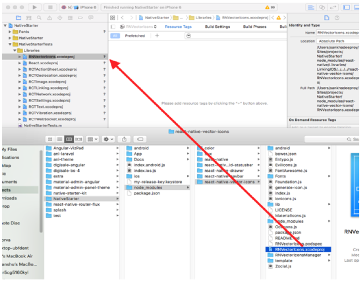

# 
[**Native Starter Pro**](http://strapmobile.com/native-starter-pro/) - The Bootstrap of [**React Native**](https://github.com/facebook/react-native)

####
Based on [**React Native**](https://github.com/facebook/react-native), [**Native Starter Pro**](http://strapmobile.com/native-starter-pro/) is a beautifully designed, responsive iOS & Android app source code to quickly get started on your next project.

####
[**Native Starter Pro**](http://strapmobile.com/native-starter-pro/) is a bold and flexible [**React Native**](https://github.com/facebook/react-native) theme best suited for developing apps that makes use of ready-made tools. The theme has several widget areas that allows you to extend your theme functionality with plugins. [**Native Starter Pro**](http://strapmobile.com/native-starter-pro/) is performance optimized.

####
####
####
####

  

####
####
####
####
## Theme Features 

#### Clean & Validated Code
	
We can boast with our ability that we provides a code which is easily editable by any person with just enough HTML/PHP knowledge.

####
#### Ready to Use Screens

Fully customizable pages with everything you need from SignUp/Login, Compose Mail, Contacts, Calendar to Settings and rich collection of UI elements.

####
#### Theme Widgets

You won’t spend a fortune on the plugins to make sure your theme sails smoothly on The Seven Seas. Highly customizable widgets are part of our never ending mission.

####
#### Mass of UI Elements

Ready to use components such as buttons, switches, form elements with ListView and ScrollView implementation and full fledged collection of Icons.

####
#### Mail

Ready to use Email Template which incorporates the core functionalities of Email process.

####
#### Contacts and Calendar

Readily available list of Contacts which are further categorized to Favourites and Recent Contacts.
Interactive design of Calendar with fast swiping feature.

####
#### Charts

This theme comes with ready-to-use dynamic chart where you can rate qualities of your product or app.

####
#### Responsive Navigator

This theme wraps navigation that provides smooth swipe functionality across your app.

####
#### Responsive Design

We know that your website needs to be accessible and readable on all devices. The theme is fully responsive so that your designs look great no matter what.

####
#### Wide Choice of Colors

We made sure that our buyers be having plenty of colors with beautiful fonts and subtle graphics to choose from in the theme options.

####
####
## Installation 

####
To use the [**Native Starter Pro**](http://strapmobile.com/native-starter-pro/) mobile theme, you need to have `npm2` globally installed.

####
* `cd NativeStarter`

####
* `npm install`

####
* For iOS
	* Go to `Xcode` and open `NativeStarter.xcodeproj` inside `ios` directory.
	* In your finder / computer, navigate to `NativeStarter` (project folder) -> node_modules -> react-native-vector-icons
	* Drag the `RNVectorIcons.xcodeproj` to the Libraries in the sidebar as explained in the image below
	  
	* Now hit run/&#8984; + R.

####
* For Android
	* Make sure you have an `Android emulator` installed and running.
	* Type `react-native run-android` in your terminal.

